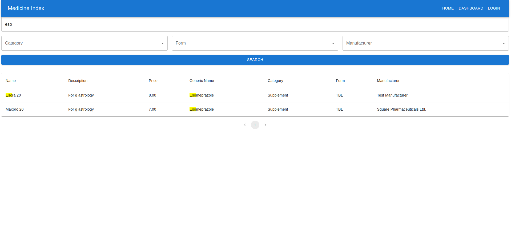

# Medicine Index Application

A comprehensive web platform that enables users to view, search, and manage medicine information, designed with role-based access for public users and administrators.


The app is live at:
[http://52.73.8.84:8081/](http://52.73.8.84:8081/)

---

## Table of Contents
1. [Features](#features)
2. [Technology Stack](#technology-stack)
3. [Setup and Installation](#setup-and-installation)
4. [Environment Variables](#environment-variables)
5. [Running the Application](#running-the-application)
6. [Using the Application](#using-the-application)
7. [Screenshots](#screenshots)
8. [Testing](#testing)
9. [Deployment](#deployment)
10. [Project Structure](#project-structure)
11. [License](#license)

---

## Features

### Public Users
- View and search for medicines by name or generic name.
- Optimized search highlighting for improved user experience.

### Admin Users
- Full CRUD (Create, Read, Update, Delete) operations on medicines.
- Role-specific access and authentication.

---

## Technology Stack

| Django   | React + TypeScript  | Redis  | MySQL  | Gunicorn |
|:--------:|:-------------------:|:------:|:------:|:--------:|
| |  |  |  |  |

### Libraries and Tools
- **Backend**: Django, Django REST Framework, Redis, MySQL
- **Frontend**: React (TypeScript), Axios
- **Deployment**: Docker, Docker Compose

---

## Setup and Installation

### Prerequisites
Ensure the following software is installed:
- **Python 3.11+**
- **Node.js 18+** and **npm**
- **Docker** and **Docker Compose**

### Installation Steps

1. **Clone the Repository**:
   ```bash
   git clone https://github.com/mubtasimfuad/medicine_index_app.git
   cd medicine_index_app
   ```

2. **Backend Setup**:
   - Create and activate a virtual environment:
     ```bash
     python3 -m venv env
     source env/bin/activate  # For Unix
     ```
   - Install Python dependencies:
     ```bash
     pip install -r requirements.txt
     ```
   - Run migrations to set up the database:
     ```bash
     python manage.py migrate
     ```

3. **Frontend Setup (React)**:
   - Navigate to the frontend directory and install Node.js dependencies:
     ```bash
     cd frontend
     npm install
     ```
   - For development, you can run:
     ```bash
     npm run dev
     ```

4. **Environment Variables**:  
   Configure environment variables in a `.env` file (details in the [Environment Variables](#environment-variables) section).

---

## Environment Variables

In the `.env` file, configure settings as follows:

```plaintext
DEBUG=1
SECRET_KEY=your_secret_key
DJANGO_ALLOWED_HOSTS=localhost,127.0.0.1
DB_HOST=host.docker.internal
DB_PORT=3306
DB_NAME=medicine_index_db
DB_USER=db_user
DB_PASSWORD=db_password
REDIS_HOST=redis://redis:6379
AWS_ACCESS_KEY_ID=your_aws_access_key
AWS_SECRET_ACCESS_KEY=your_aws_secret_key
USE_S3=False
```

---

## Running the Application

### Docker Setup (Recommended for Production)

To start the application using Docker Compose:
```bash
docker-compose up --build -d
```

This setup includes:
- Django with Gunicorn on port `8000`
- Redis cache on port `6379`
- Nginx serving the application on port `8081`

### Local Development

1. **Backend**:
   ```bash
   python manage.py runserver
   ```

2. **Frontend**:
   ```bash
   cd frontend
   npm start
   ```

Access the app at `http://localhost:3000` (frontend) and `http://localhost:8000` (backend APIs).

---

## Using the Application

- **Public Access**: View and search medicines.
- **Admin Access**:
  - Login to the Django admin dashboard at `/admin`.
  - Perform CRUD operations for medicine management.

### API Documentation
Swagger documentation for the API is available at:
- `http://localhost:8000/swagger/`

---

## Screenshots

### 1. Admin Login


### 2. Admin Dashboard


### 3. Medicine Search Results


---

## Testing

The project includes unit tests and integration tests written using `pytest`. To run all tests:

1. For a local environment:
   ```bash
   pytest -v
   ```
2. Within the Docker container:
   ```bash
   docker exec -it medicine_index_app-web-1 pytest -v
   ```

Unit and integration tests cover all crucial features, ensuring reliable TDD development.

---

## Deployment

The application is production-ready with Docker and Nginx configurations. **Gunicorn** serves Django in a secure, scalable environment, with Redis for caching.

**On EC2 or Cloud Server**:
1. Open necessary ports on your security group (e.g., `8081`).
2. Deploy using `docker-compose` as instructed above.

---

## Project Structure

```plaintext
medicine_index_app/
├── core/                # Main Django application
├── inventory/           # Medicine management app
├── authentication/      # User authentication and permissions
├── frontend/            # React frontend
├── utils/               # Utility functions and Redis cache management
├── Dockerfile
├── docker-compose.yml
├── requirements.txt
└── README.md
```

---

## License

This project is licensed under the MIT License.

Find the complete codebase on GitHub at [medicine_index_app](https://github.com/mubtasimfuad/medicine_index_app). 

---

